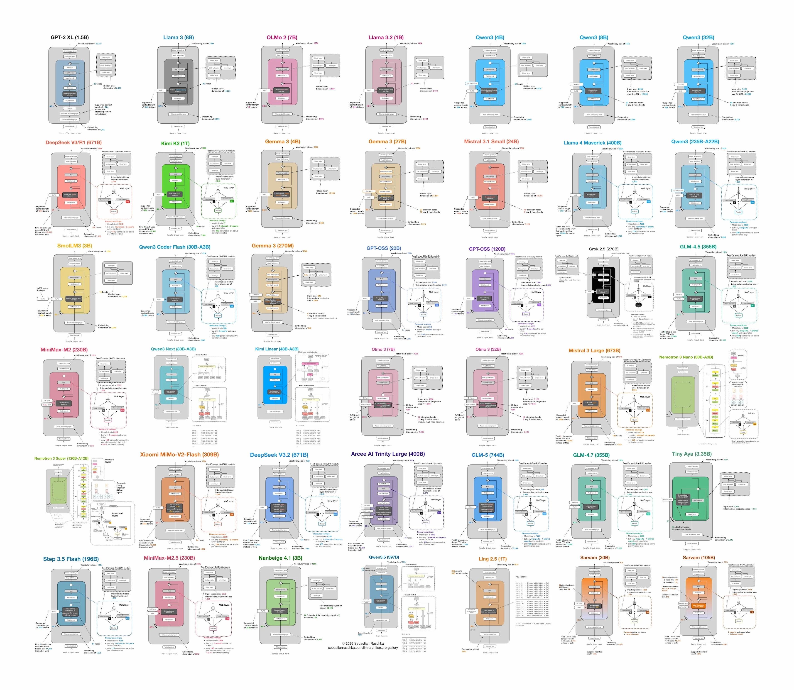

# miniature-llms

A hands-on learning resource for modern LLM architecture components, implemented in PyTorch and JAX.


*Original image by Sebastian Raschka — [available here](https://rasbt.gumroad.com/l/llm-gallery)*

---

## Philosophy

Think of this repo as a **1/1000 scale of the model** — the structure is real, the loss will decrease but not scaled and do not expect much in inferencing. Every component here is **correct but not optimized**: no CUDA kernels, no memory-efficient tricks, no production-grade engineering. The goal is to learn the mechanism clearly, not to make it fast.

This means:
- Some components (e.g. Flash Attention, KV Cache) exist as standalone correct implementations but may not be wired into model architectures, because a toy integration would misrepresent how they actually function at scale.
- Implementations are verified by training on a tiny dataset on CPU and confirming loss decreases — not by benchmark.
- Both PyTorch (`pytorch.py`) and JAX (`jax.py`) versions are provided per component.

---

## Structure

```
miniature-llms/
├── 1_BytePairEncodingTokenization/
│   ├── explanation.md      # what, why, intuition, gotchas
│   ├── pytorch.py
│   └── jax.py
├── 2_TokenEmbedding/
│   └── ...
├── ...
└── OpenModels/
    ├── qwen-3.5-4B/        # composes components into a full architecture
    └── ...
```

**Numbered component folders** — each covers one architectural concept. Numbers are identifiers, not a strict learning order.

**`explanation.md`** — verbal, intuitive explanation of the concept: what it does, why it exists, what it improves over the alternative, and what subtle things to be aware of. Written at the conceptual level so it does not drift as implementations evolve.

**`OpenModels/`** — full model architectures assembled from the components above. Each model file reads like a recipe: you can see at a glance which components were chosen and how they are wired together. Example: `qwen-3.5-4B` uses `CausalMultiheadAttention` with `RoPE` and `GroupedQueryAttention`, while a Mamba-based model replaces attention with `MambaStateSpace`.

---

## Tensor Shape Convention

All implementations share the same dimension ordering and naming for modularity. Single-letter variables are not used.

| Name | Meaning |
|---|---|
| `batch_size` | number of sequences in a batch |
| `seq_len` | number of tokens in a sequence |
| `model_dim` | model hidden dimension (also called `d_model`) |
| `num_heads` | number of attention heads |
| `head_dim` | dimension per attention head (`model_dim // num_heads`) |
| `vocab_size` | size of the token vocabulary |
| `ffn_dim` | feed-forward network inner dimension |

Tensors flow as `(batch_size, seq_len, model_dim)` through all sequence-level components. Deviations from this (e.g. inside attention where heads are split out) are always explicit and local.

---

## Components

| # | Component | What it does |
|---|---|---|
| 1 | BytePairEncoding Tokenization | Learns a vocabulary by merging frequent character pairs |
| 2 | Token Embedding | Maps token ids to dense vectors |
| 3 | RoPE | Rotary positional encoding — encodes position into Q and K |
| 4 | YaRN | Extends RoPE to longer contexts than it was trained on |
| 5 | SWiGLU | Gated activation function used in feed-forward blocks |
| 6 | RMSNorm | Simpler, faster alternative to LayerNorm |
| 7 | Causal Multihead Attention | Scaled dot-product attention with causal mask |
| 8 | KV Cache | Caches past K/V tensors to avoid recomputation at inference |
| 9 | Residual Block | Wraps a sublayer with a skip connection |
| 10 | Grouped Query Attention | Shares K/V heads across groups of Q heads |
| 11 | Mixture of Experts | Routes tokens to different feed-forward experts |
| 12 | Flash Attention | IO-aware exact attention (standalone — not wired into models at toy scale) |
| 13 | Mamba State Space | Selective state space model as an alternative to attention |

---

## OpenModels

| Model | Key components used |
|---|---|
| qwen-3.5-4B | RoPE, GQA, SWiGLU, RMSNorm, KV Cache |
| deepseek-v4 | MoE, GQA, RoPE, RMSNorm |
| kimi-k2 | MoE, MLA (multi-head latent attention) |
| minimax-m3 | Hybrid attention + Mamba |
| glm-5 | RoPE, GQA, SWiGLU |

---

## Verification

Each component can be tested individually by constructing a random input tensor with the expected shape and checking that the output shape is correct. Full model correctness is verified by running a tiny training loop on CPU:

```python
# shapes to use for smoke tests
batch_size, seq_len, model_dim = 2, 16, 64
```

Loss should decrease within a few steps. If it does not, the implementation has a bug.